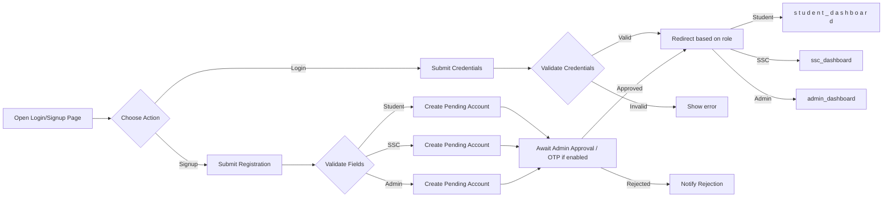
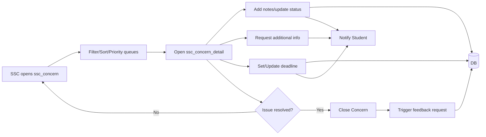
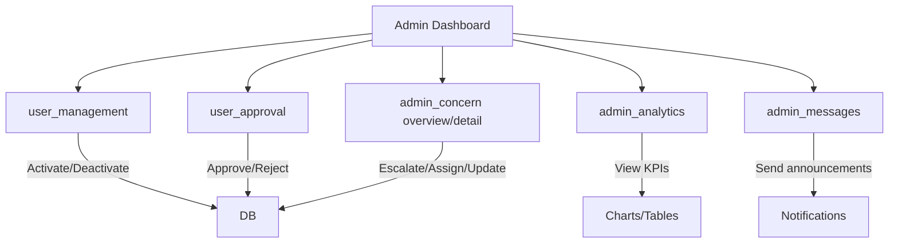
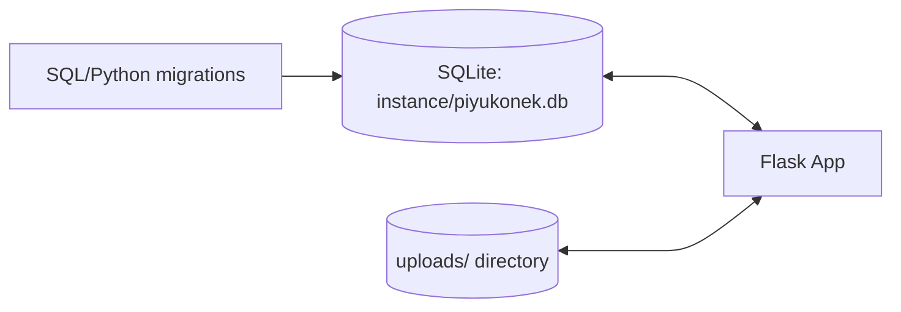

## PIYUKONEK System Flowcharts

Below are Mermaid flowcharts covering the overall system and the core user flows. You can preview these directly in many Markdown viewers that support Mermaid (e.g., GitHub, VS Code with Mermaid extension).

### Overall System (High-Level)
```mermaid
flowchart TD
  subgraph Client[Web Client (Browser)]
    UI[HTML/CSS/JS Templates] -->|Forms/Clicks| SM[session_manager.js]
  end

  SM -->|HTTP(S) Requests| FL[Flask App (piyukonek/app.py)]
  FL --> RT[Route Handlers / Controllers]
  RT --> SV[Services / Business Logic]
  SV --> DB[(SQLite DB: instance/piyukonek.db)]
  SV --> FS[(File Storage: uploads/)]

  subgraph Roles
    A[Admin]
    S[Student]
    SSC[SSC]
  end

  A --- UI
  S --- UI
  SSC --- UI

  DB <-. migrations .-> MIG[Migration Scripts (SQL/Python)]
```

### Authentication & Account Management


### Student Concern Lifecycle
```mermaid
flowchart TD
  S0[Student: Open concern page] --> S1[Create Concern (title, desc, type, priority,...)]
  S1 --> S2[Attach files (uploads/)]
  S2 --> S3[Submit]
  S3 --> B1[Backend validates & saves]
  B1 --> DB[(DB)]
  B1 --> TL[Initialize Timeline/Status]
  TL --> N1[Notify SSC/Admin as configured]

  N1 --> SSCV[SSC Views concern list]
  S3 --> STV[Student views concern_timeline]

  subgraph Updates
    SSCV --> ACT[SSC adds update / request info / set deadline]
    ACT --> DB
    ACT --> TL
    TL --> N2[Notify Student]
    N2 --> STV
  end

  subgraph Resolution
    ACT --> RES{Resolved?}
    RES -->|Yes| C1[Mark resolved/closed]
    C1 --> FB[Collect rating/feedback]
    FB --> DB
    RES -->|No| Loop[Continue updates]
    Loop --> SSCV
  end
```

### SSC Handling Flow


### Admin Oversight & Management


### Notifications & Messaging
```mermaid
flowchart LR
  EVT[System Events: new concern, update, deadline, approval] --> NT[Create Notification]
  NT --> DB[(DB)]
  DB --> UI[Notifications UI (per role)]
  UI --> READ[Mark as read]
  READ --> DB
```

### Data Storage


Notes
- These diagrams reflect the repository structure: Flask backend, role-based templates, SQLite database in `instance/`, and file uploads in `uploads/`.
- If OTP or email is used for verification, place those steps between registration and approval in the Auth flow.
- Adjust names (e.g., route titles) if UI labels differ in your templates.


